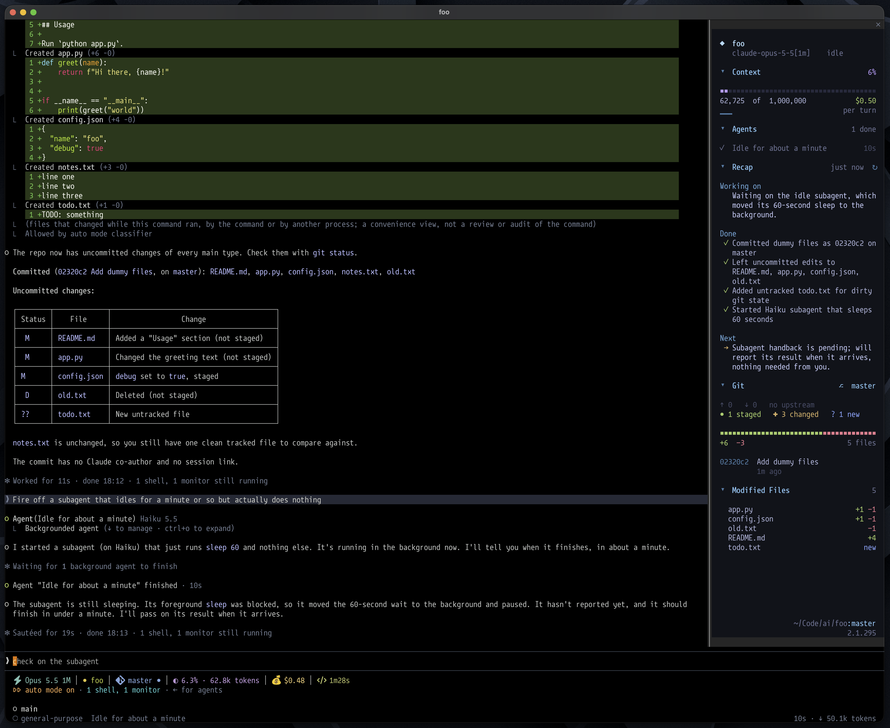

# Mission Control

A sidebar for Claude Code. It shows what the session is doing while you work: context usage, git state, the files Claude touched, the todo list, running subagents, and a short recap of the conversation.



## Install

In a Claude Code terminal session:

```
/plugin install mission-control --marketplace dphase/claude-mission-control
```

Answer `y` to add the marketplace, then press Enter to install at the user scope. The sidebar opens on its own once the terminal is wide enough.

To remove it:

```
/plugin uninstall mission-control
```

## What's in it

- **Header**: session title, model, and how long the current turn has been running.
- **Context**: percent of the context window used, a per-turn sparkline, and session cost.
- **Git**: branch, ahead/behind, staged/changed/new counts, line churn, and the last commit.
- **Modified Files**: changed files, with the ones Claude edited this session marked.
- **Todo**: Claude's task list, with the active task highlighted.
- **Agents**: running subagents with their type, step count, current tool, and an ETA learned from past runs of the same type.
- **Recap**: what you asked, what's done, and what's next. Haiku writes it after each turn from the last few messages.
- **Artifacts**: pages Claude published this session, newest first. Click one to open it in your browser.

Click a section header to fold it.

The Artifacts icon is a Nerd Font glyph. Use a Nerd Font, or a terminal that bundles the symbols (Ghostty does); otherwise it draws as an empty box.

## Commands

| Command | Does |
| --- | --- |
| `/mc` | Toggle the sidebar |
| `/mc open` | Open it |
| `/mc close` | Close it and keep it closed in new sessions |
| `/mc recap` | Refresh the recap now |

## Cost

The recap makes one Haiku call per turn, capped at 400 output tokens.

## Developing

Run Claude Code with the repo loaded from disk:

```
claude --plugin-dir ~/path/to/claude-mission-control
```

The session watches the folder and reloads the mod when you save. `claude plugin validate .` checks the manifest and the hooks module.
